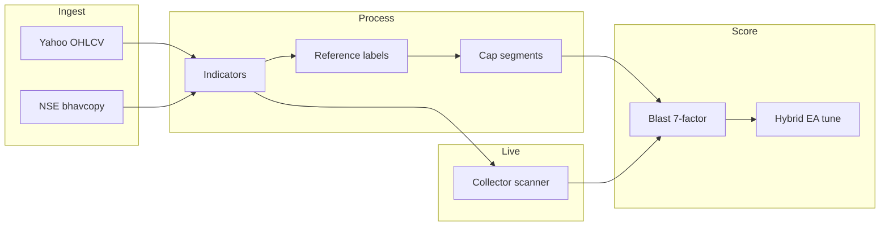

# A-trade

Indian equity research pipeline for **Nifty 500** swing setups. Fetches daily OHLCV and NSE delivery data, computes Reference-aligned indicators, labels **reference 3-day swing** outcomes, scores candidates with a **seven-factor blast engine**, and tunes factor weights with a hybrid evolutionary optimizer.

## What it does



| Stage | Entry point | Output |
|-------|-------------|--------|
| Dataset build | `build_dataset.py` | Segment parquets, `data/splits.yaml` |
| Blast smoke / tune | `python -m blast.smoke`, `python -m blast.tune_weights` | Ranked picks, tuned `weights_*.yaml` |
| Live scan | `python Collector/start.py` | DuckDB scan runs with `blast_score` |

## Quick start

```powershell
cd A-trade
pip install -r requirements.txt
python build_dataset.py
```

### Dev smoke test (fast)

```powershell
python build_dataset.py --days 120 --max-symbols 15 --fresh
python -m blast.smoke --segment mid_cap --top-n 10
```

Use `--skip-delivery` only when you want a faster run without delivery features.

## Dataset pipeline

Five phases run in order when you call `build_dataset.py`:

| Phase | What it does | Output |
|-------|--------------|--------|
| 1 | Fetch OHLCV (Yahoo) | `data/atrade.duckdb`, `data/raw/ohlcv/` |
| 2 | Fetch NSE bhavcopy delivery | `data/raw/bhavcopy/` |
| 3 | Cap-segment map | `data/processed/segment_map.parquet` |
| 4 | Indicators + reference labels | `data/processed/segments/*.parquet` |
| 5 | Splits + optional top-N | `data/splits.yaml` |

### CLI flags

| Flag | Description |
|------|-------------|
| `--days N` | Fetch only last N calendar days; lowers min bars; auto 60/20/20 split |
| `--max-symbols N` | Limit to first N Nifty 500 tickers |
| `--top-n N` | Rank on train window only; filter to top N symbols |
| `--skip-fetch` | Reuse cached DuckDB OHLCV |
| `--skip-delivery` | Skip NSE bhavcopy |
| `--refresh` | Force re-download OHLCV from Yahoo |
| `--fresh` | Delete generated data and rebuild |

### Label profile

Single profile: **reference_swing** (3-day swing, next-open entry).

| Parameter | Value |
|-----------|-------|
| Target | +4% |
| Stop | −2.5% |
| Forward days | 3 |
| Outcome column | `outcome_reference` |

Defined in `config/labels.yaml`. Indicator thresholds in `config/settings.yaml` → `reference_rules`.

## Blast scoring

Seven weighted factors (weights sum to **100**). Sub-scores are fixed in v1; the EA tunes weights only.

| Factor | Role |
|--------|------|
| Trend | EMA stack, slope, ADX |
| Breakout | 52w/20d highs, close position |
| Volume | Volume ratio vs 20d average |
| Delivery | NSE delivery % |
| Momentum | RSI, MACD, ADX rising |
| Sector | Sector breadth (% above EMA20) |
| Risk | ATR extension, liquidity |

**Alert bands:** 85+ A+, 75–84 A, 65–74 B, below 65 ignored.

Liquidity and macro filters gate the **daily ranking pool** but do not zero `blast_score`.

### Commands

```powershell
# Top picks for latest day (or --date YYYY-MM-DD)
python -m blast.smoke --segment mid_cap --top-n 10

# Baseline Precision@10 (blueprint weights)
python -m blast.tune_weights --baseline-only

# Tune weights — quick (~2 min/segment) or full (~30 min/segment)
python -m blast.tune_weights --quick
python -m blast.tune_weights

# Archive a run (logs + weights copied to runs/)
python -m blast.tune_weights --run-label run_03
```

### Weight files

| Path | Purpose |
|------|---------|
| `data/blast/weights_{segment}.yaml` | Active tuned weights (scanner + research) |
| `data/blast/standard/` | Frozen baseline (run_01) |
| `data/blast/runs/run_XX/` | Archived manifest, logs, weight copies |

Optimizer picks the candidate with best **validation Precision@10** (seeds + differential evolution + Nelder-Mead polish). See [docs/BLAST_SCORE_IMPLEMENTATION_PLAN.md](docs/BLAST_SCORE_IMPLEMENTATION_PLAN.md) for design detail.

### Live scanner

```powershell
python Collector/start.py
```

Downloads latest bars, computes indicators, scores with per-segment tuned weights, and stores symbols at or above the B band (65) in DuckDB scan tables.

## Project layout

```
A-trade/
  build_dataset.py              # Five-phase dataset CLI
  Collector/
    config.py                   # Paths; loads config/settings.yaml
    db.py                       # DuckDB OHLCV + scan storage
    delivery.py                 # NSE bhavcopy fetch
    indicators.py               # Technical features (no lookahead)
    labeling.py                 # Reference 3-day swing outcomes
    segments.py                 # Large / mid / small cap mapping
    start.py                    # Live scanner (blast scoring)
  pipeline/
    fetch.py                    # Bulk Yahoo download
    process.py                  # Indicators + labels → parquets
    splits.py                   # Train / val / test ranges
    universe.py                 # Top-N train-period ranking
  blast/
    scoring.py                  # Sub-scores + blast_score + ranking
    filters.py                  # Eligibility pool (price, ADTV, breadth)
    enrich.py                   # Load parquets + sector_breadth
    live.py                     # Live batch scoring
    explain.py                  # Per-row factor breakdown
    tune_weights.py             # Hybrid EA CLI
    smoke.py                    # One-day smoke test
    categories/                 # Seven sub-score functions
    optimize/                   # Fitness, DE, evaluation, seeds
    config/blast.yaml           # Default weights, bands, optimizer
  config/
    settings.yaml               # Fetch, filters, indicators
    labels.yaml                 # Reference swing profile
    splits.yaml                 # Production split template
  data/                         # Generated (see .gitignore)
  docs/
    ARCHITECTURE.md             # Module map and data flow
    BLAST_SCORE_IMPLEMENTATION_PLAN.md
```

For a per-module reference, see [docs/ARCHITECTURE.md](docs/ARCHITECTURE.md).

## Git and generated data

`.gitignore` excludes bulk datasets (parquets, DuckDB, raw OHLCV/bhavcopy) and weight YAMLs. **Tracked** under `data/`:

- `data/splits.yaml`, `data/sector_map.csv`
- `data/blast/tune_*.log` and `data/blast/runs/**/tune_*.log`
- `data/blast/runs/**/manifest.yaml`

Rebuild datasets locally with `build_dataset.py`; re-tune or copy weights from run archives as needed.

## Requirements

```powershell
pip install -r requirements.txt
```

Core: `pandas`, `numpy`, `pyarrow`, `duckdb`, `yfinance`, `pyyaml`, `tqdm`, `scipy`, `ta`.
