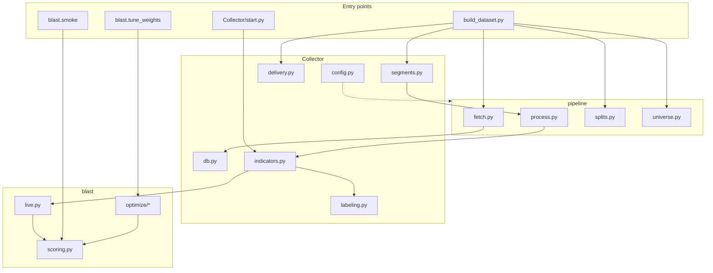

# A-trade architecture

Module reference for the Nifty 500 swing-research pipeline: ingest → process → score → tune → live scan.

## System overview



**Data flow:** Yahoo OHLCV and NSE bhavcopy land in DuckDB and raw folders. `pipeline/process.py` builds per-symbol indicator rows, applies reference labels, and writes cap-segment parquets. `blast` reads those parquets for backtests and tuning; `Collector/start.py` scores live bars with the same formulas and tuned weights.

---

## Root

| Module | Role |
|--------|------|
| `build_dataset.py` | Single CLI orchestrating all five dataset phases: fetch OHLCV, fetch delivery, segment map, process symbols, write splits (and optional top-N universe). |
| `requirements.txt` | Python dependencies (`pandas`, `duckdb`, `yfinance`, `scipy`, `ta`, etc.). |

---

## `Collector/` — data access, features, live scanner

Shared by the batch pipeline and the live scanner. Paths and thresholds come from `config/settings.yaml` via `Collector/config.py`.

| Module | Role |
|--------|------|
| `config.py` | Project paths (`DATA_DIR`, `DB_PATH`, segment dirs), YAML settings loader, and per-run overrides (`set_runtime` for `--days` / `--max-symbols`). |
| `db.py` | DuckDB schema and I/O: `ohlcv_daily`, `symbol_meta`, `scan_runs`, `scan_passed`. Thread-safe save/load for OHLCV and scan results. |
| `delivery.py` | Downloads NSE equity bhavcopy CSVs, parses delivery %, caches under `data/raw/bhavcopy/`. Used in batch process and optional dataset builds. |
| `indicators.py` | Reference-aligned technical features (EMAs, RSI, MACD, ADX, ATR, volume ratio, 52w/20d highs, etc.). No lookahead; rules from `reference_rules` in settings. |
| `labeling.py` | Forward outcome labeling for the **reference_swing** profile (+4% / −2.5% / 3 days, next-open entry). Writes `outcome_reference` and aliases `outcome`. |
| `segments.py` | Maps each symbol to `large_cap`, `mid_cap`, or `small_cap` using NSE index constituent lists. |
| `start.py` | **Live scanner:** Nifty 500 download → indicators → `blast.live.score_scan_batch` → persist passing symbols (score ≥ B band) to DuckDB. |

---

## `pipeline/` — batch dataset build

Invoked by `build_dataset.py`. Does not run during a normal live scan.

| Module | Role |
|--------|------|
| `fetch.py` | Parallel Yahoo OHLCV download for the Nifty 500 universe into DuckDB (+ optional raw parquet). |
| `process.py` | Two-pass symbol processing: compute indicators, merge delivery, apply labels, attach segment and market breadth; write `data/processed/segments/*.parquet`. |
| `splits.py` | Resolves train / validation / test date ranges from `config/splits.yaml` or auto-ratios in dev mode; writes `data/splits.yaml`. |
| `universe.py` | Optional top-N filter: ranks symbols on train-period setup edge only (no validation leakage), writes filtered parquet and metadata JSON. |

---

## `blast/` — scoring engine and weight tuning

Consumes processed segment parquets (`outcome_reference` + indicator columns). Sub-score formulas are fixed in v1; the hybrid EA tunes integer weights (sum 100) only.

### Core

| Module | Role |
|--------|------|
| `__init__.py` | Public exports: `compute_blast_score`, `rank_eligible_day`. |
| `_config.py` | Loads `blast/config/blast.yaml` and merges settings thresholds; resolves active → standard → blueprint weights from `data/blast/`. |
| `scoring.py` | Computes seven `subscore_*` columns and weighted `blast_score` (0–100); `grade_alerts` and `rank_eligible_day` for daily top-N pools. |
| `filters.py` | Eligibility mask (min price, segment ADTV, market breadth). Filters gate ranking only — they never zero `blast_score`. |
| `enrich.py` | Loads segment parquets and adds `sector` + `sector_breadth` (required by sector scorer). |
| `explain.py` | Per-row weighted factor breakdown for smoke output and debugging. |
| `live.py` | Live path: merge scanner rows, per-segment tuned weights, eligibility + min alert score for `Collector/start.py`. |
| `smoke.py` | CLI: score one session date, print top-N with factor points. |
| `tune_weights.py` | CLI: baseline metrics, hybrid EA per segment, writes `weights_*.yaml`, optional `--run-label` archive. |

### `blast/categories/` — sub-scorers (each returns [0, 1])

| Module | Role |
|--------|------|
| `trend.py` | EMA stack, slope, ADX strength. |
| `breakout.py` | 52-week / 20-day highs, close position in range. |
| `volume.py` | Volume ratio vs 20d average, breakout volume flags. |
| `delivery.py` | NSE delivery % vs threshold and above-average delivery. |
| `momentum.py` | RSI zone, MACD bullish/rising, ADX rising. |
| `sector.py` | Sector breadth (% of sector above EMA20). |
| `risk.py` | ATR risk, pullback from EMA20, liquidity (ADV). |
| `__init__.py` | Registry `CATEGORY_FUNCS` mapping names to scorer functions. |

### `blast/optimize/` — hybrid EA

| Module | Role |
|--------|------|
| `fitness.py` | `FitnessContext`: precomputes per-day eligible pools; `precision_at_k` with sparse-pool and false-alert penalties. |
| `hybrid_ea.py` | Seeds + `scipy` differential evolution + Nelder-Mead polish; winner by **validation Precision@10**. |
| `evaluate.py` | Wilson CI, lift, and formatted reports across train/val/test contexts. |
| `simplex.py` | Softmax logits → integer weights summing to 100 (`repair_integer_weights`). |
| `lift_seeds.py` | Seed generators: standard (run_01), blueprint, lift-proportional, random. |
| `splits.py` | Reads `data/splits.yaml` and masks rows by split name (used by fitness). |

### `blast/config/`

| File | Role |
|------|------|
| `blast.yaml` | Default weights, alert bands (A+/A/B), filter overrides, optimizer hyperparameters (`de_popsize`, `min_weight_per_category`, etc.). |

---

## `config/` — YAML configuration

| File | Role |
|------|------|
| `settings.yaml` | Fetch window, liquidity filters, indicator parameters, `reference_rules` thresholds. |
| `labels.yaml` | Label profiles; production uses `reference_swing` only. |
| `splits.yaml` | Template/default split dates; runtime splits are written to `data/splits.yaml`. |

---

## `data/` — generated artifacts

Not all paths are committed; see `.gitignore`.

| Path | Role |
|------|------|
| `atrade.duckdb` | OHLCV cache and live scan tables (ignored). |
| `raw/ohlcv/`, `raw/bhavcopy/` | Raw downloads (ignored). |
| `processed/segments/*.parquet` | Labeled indicator panels per cap segment (ignored). |
| `splits.yaml` | Resolved train/val/test bounds (tracked). |
| `sector_map.csv` | Symbol → sector mapping (tracked). |
| `blast/weights_*.yaml` | Active tuned weights (ignored; regenerate via tune). |
| `blast/runs/run_XX/` | Run manifests and tune logs (tracked); weight copies ignored. |

---

## `docs/`

| File | Role |
|------|------|
| `ARCHITECTURE.md` | This document — module map and data flow. |
| `BLAST_SCORE_IMPLEMENTATION_PLAN.md` | Design notes: factor formulas, EA protocol, phase checklist. |

---

## Typical workflows

**Full research dataset**

```
build_dataset.py → segment parquets + splits.yaml
blast.tune_weights → weights_*.yaml (+ optional runs/run_XX archive)
blast.smoke → sanity-check one day
```

**Live production scan**

```
Collector/start.py → DuckDB scan_passed (blast_score ≥ 65, per-segment weights)
```

---

## Extension points

- **New label profile:** add to `config/labels.yaml`, wire in `labeling.py`, rebuild dataset.
- **New blast factor:** add `blast/categories/*.py`, register in `CATEGORY_FUNCS`, extend `CATEGORY_ORDER` in `simplex.py`, re-run EA.
- **News / catalyst:** planned as alert-stage filter (not a scored factor until historical news data exists).
